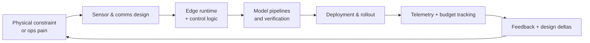
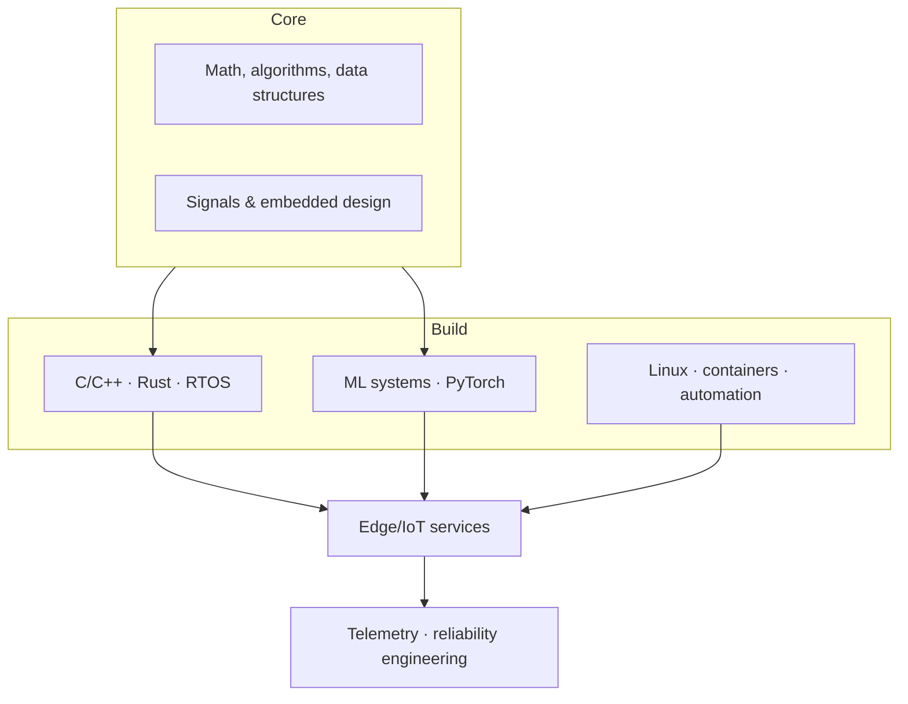

# Kamal Bura

Engineering student in AI, IoT, and computer systems who moves ideas from lab notebooks to deployed infrastructure. I design sensing stacks, inference services, and the automation between them so hardware, models, and operations converge. Constraints are treated as inputs, not blockers.

## Systems I build
I map field constraints into measurable interfaces, then tie embedded firmware, ML services, and cloud automation together with observability from day zero.

## Technical foundation
I invest in fundamentals, then layer device engineering, intelligence, and delivery practices on top. Each layer is testable in isolation and instrumented end-to-end.

## Stack in active use
- Languages: Python, C/C++, Rust (driver-level), TypeScript for tooling
- Platforms: Linux, Zephyr RTOS, ESP-IDF, NVIDIA Jetson, AWS IoT Core
- Tooling: ROS2, PyTorch, scikit-learn, PostgreSQL, Docker, GitHub Actions
- Focus: sensor fusion, edge-to-cloud data contracts, verification harnesses

## Currently building & learning
- Delivering a field-ready sensing rig that streams structured telemetry into lightweight anomaly-scoring services.
- Evolving MCU firmware practices with fuzzing, property-based tests, and selective Rust adoption for safety-critical paths.
- Studying control-theoretic reinforcement methods for real-time decision stacks.

## Operating principles
- Every module exposes a contract, metrics, and rollback story before it earns production time.
- Observability is part of the design spec, not a postmortem patch.
- Engineer for evolvability: prefer composable pipelines and typed interfaces.
- Power, latency, and data budgets sit beside accuracy when evaluating trade-offs.

## GitHub activity
Pinned repositories highlight representative slices: device firmware, ML inference services, and deployment tooling. Watch the commit graph for in-flight experiments, or open an issue with context if you want to discuss a system or review code.
