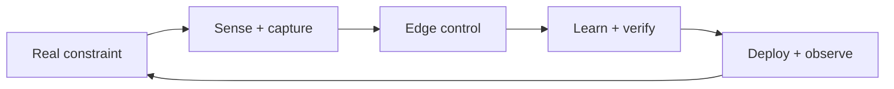

# Kamal Bura

Engineering student building AI + IoT systems that actually run on devices. I keep things grounded: measure the field, model what matters, ship only what survives constraints.

## What I build
- Sensor-driven prototypes that feed compact ML services
- Edge runtimes that stay within power, latency, and data budgets
- Deployment glue so firmware, models, and cloud stay in sync

## Stack snapshot
- Languages: Python, C/C++, Rust-in-progress, TypeScript for tools
- Platforms: Linux, Zephyr, ESP-IDF, Jetson, AWS IoT Core
- Tooling: PyTorch, ROS2, PostgreSQL, Docker, GitHub Actions

## Currently focused on
- Telemetry-friendly sensor rig with lightweight anomaly scoring
- Safer MCU firmware via property-based tests + selective Rust
- Control + learning hybrids for tighter real-time loops

## How I work
- Start simple, make it observable, then tune
- Write down interfaces and rollback steps before release
- Budget power, latency, and data the same way I budget accuracy

## Around this GitHub
Pinned repos show firmware, ML services, and deployment scripts. If something sparks an idea, open an issue or ping me—always open to thoughtful reviews and collaborations.
